<div align="center">
  

  # Memoria

  **The World's First Git for AI Agent Memory**

  *Snapshot · Branch · Merge · Rollback — for memory, not code.*

  > Git made code safe to change. Memoria makes memory safe to change.

  [](https://github.com/matrixorigin/Memoria/actions/workflows/test.yml)
  [](https://github.com/matrixorigin/Memoria/releases)
  [](https://github.com/matrixorigin/Memoria/stargazers)
  [](https://github.com/matrixorigin/Memoria/releases)
  [](LICENSE)
  [](https://modelcontextprotocol.io)
  [](https://github.com/matrixorigin/matrixone)

  [Quick Start](#-quick-start) · [Why Memoria](#-why-memoria) · [See It in Action](#-see-git-for-data-in-action) · [API Reference](#-api-reference) · [Architecture](#-architecture) · [Development](#-development)

</div>

---

## Overview

Memoria is a **persistent memory layer** for AI agents with Git-level version control.
Every memory change is tracked, auditable, and reversible — snapshots, branches, merges, and time-travel rollback, all powered by [MatrixOne](https://github.com/matrixorigin/matrixone)'s native Copy-on-Write engine.

<table>
<tr>
<td align="center" width="33%">

**🔀 Git for Memory**

Zero-copy branching, instant snapshots, point-in-time rollback — version control for every memory mutation

</td>
<td align="center" width="33%">

**🔍 Semantic Search**

Vector + full-text hybrid retrieval finds memories by meaning, not just keywords

</td>
<td align="center" width="33%">

**🛡️ Self-Governing**

Auto-detects contradictions, quarantines low-confidence memories, maintains audit trails

</td>
</tr>
</table>

<table>
<tr>
<td align="center" width="33%">

**🔒 Private by Default**

Local embedding model option — no data leaves your machine

</td>
<td align="center" width="33%">

**🧠 Cross-Conversation**

Preferences, facts, and decisions persist across sessions

</td>
<td align="center" width="33%">

**📋 Full Audit Trail**

Every memory mutation has a snapshot + provenance chain

</td>
</tr>
</table>

### Supported Agents

<p align="center">
  <a href="https://kiro.dev"></a>
  <a href="https://cursor.sh"></a>
  <a href="https://docs.anthropic.com/en/docs/claude-code"></a>
  <a href="https://openai.com/index/introducing-codex/"></a>
  <a href="https://geminicli.com"></a>
  <a href="plugins/openclaw/README.md"></a>
</p>

<p align="center"><i>Works with any MCP-compatible agent</i></p>

---

## 🚀 Quick Start

<details open>
<summary><b>☁️ Memoria Cloud (Recommended — no Docker, no database)</b></summary>
<br/>

**1. Sign up** at [thememoria.ai](https://thememoria.ai/auth) and get your token

**2. Install & configure**
```bash
curl -sSL https://raw.githubusercontent.com/matrixorigin/Memoria/main/scripts/install.sh | bash
cd your-project
memoria init -i   # Select "Remote" mode, paste your token
```

**3. Restart & verify** — restart your AI tool, then ask: *"Do you have memory tools available?"*

</details>

<details>
<summary><b>🐳 Self-Hosted (Docker — full data control)</b></summary>
<br/>

```bash
# 1. Start MatrixOne + API
git clone https://github.com/matrixorigin/Memoria.git
cd Memoria
docker compose up -d

# 2. Install CLI
curl -sSL https://raw.githubusercontent.com/matrixorigin/Memoria/main/scripts/install.sh | bash

# 3. Configure your AI tool
cd your-project
memoria init -i   # Select "Embedded" mode
```

Restart your AI tool, then ask: *"Do you have memory tools available?"*

</details>

<details>
<summary><b>🦞 OpenClaw Plugin</b></summary>
<br/>

Use the native OpenClaw plugin: [OpenClaw Plugin Setup](plugins/openclaw/README.md)

```bash
# ensure memoria CLI exists
command -v memoria >/dev/null || curl -sSL https://raw.githubusercontent.com/matrixorigin/Memoria/main/scripts/install.sh | bash -s -- -y -d ~/.local/bin

# install & enable
openclaw plugins install @matrixorigin/memory-memoria
openclaw plugins enable memory-memoria

# cloud-first setup
openclaw memoria setup --mode cloud --api-url <MEMORIA_API_URL> --api-key <MEMORIA_API_KEY> --install-memoria
openclaw memoria health
```

</details>

Or download binaries directly from [GitHub Releases](https://github.com/matrixorigin/Memoria/releases). For detailed setup, see [Setup Skill](skills/setup/SKILL.md).

---

## 💡 Why Memoria?

| Capability | Memoria | Letta / Mem0 / Traditional RAG |
|---|---|---|
| **Git-level version control** | Native zero-copy snapshots & branches | File-level or none |
| **Isolated experimentation** | One-click branch, merge after validation | Manual data duplication |
| **Audit trail** | Full snapshot + provenance on every mutation | Limited logging |
| **Semantic retrieval** | Vector + full-text hybrid search | Vector only |
| **Self-governance** | Automatic contradiction detection & quarantine | Manual cleanup |

---

## 🎬 See Git for Data in Action

<p align="center">
  
</p>

A story-writing scenario demonstrates the core concept: an author has accepted story beats on `main`, opens an experimental branch for a different plot direction, merges the stronger draft back, and rolls back when the newest beats don't work.

<details>
<summary><b>What the demo shows</b></summary>

- **Main storyline** — accepted story beats live on `main`
- **Experimental branch** — the author tries a new plot turn without rewriting canon
- **Merge** — the stronger draft is promoted back into the main storyline
- **Rollback** — the last two bad turns are discarded, and writing resumes from a safe snapshot

</details>

---

## 📖 Steering Rules

Steering rules teach your AI agent **when and how** to use memory tools. Without them, the agent has tools but no guidance — like having a database without knowing the schema.

| Rule | Purpose |
|------|---------|
| `memory` | Core memory tools — when to store, retrieve, correct, purge |
| `session-lifecycle` | Bootstrap at conversation start, cleanup at end |
| `memory-hygiene` | Proactive governance, contradiction resolution, snapshot cleanup |
| `memory-branching-patterns` | Isolated experiments with branches |
| `goal-driven-evolution` | Track goals, plans, progress across conversations |

**File locations:** Kiro: `.kiro/steering/*.md` · Cursor: `.cursor/rules/*.mdc` · Claude: `.claude/rules/*.md` · Codex: `AGENTS.md` · Gemini CLI: `GEMINI.md` + `.gemini/*.md`

After upgrading: `memoria rules --force`

<details>
<summary><b>Example: Conversation Lifecycle</b></summary>

```
┌─────────────────────────────────────────────────────────────────────────────┐
│  CONVERSATION START                                                         │
│  ┌─────────────────────────────────────────────────────────────────────┐   │
│  │ 1. memory_retrieve(query="<user's question>")  ← load context       │   │
│  │ 2. memory_search(query="GOAL ACTIVE")          ← check active goals │   │
│  └─────────────────────────────────────────────────────────────────────┘   │
├─────────────────────────────────────────────────────────────────────────────┤
│  MID-CONVERSATION                                                           │
│  ┌─────────────────────────────────────────────────────────────────────┐   │
│  │ • User states preference → memory_store(type="profile")             │   │
│  │ • User corrects a fact   → memory_correct(query="...", new="...")   │   │
│  │ • Topic shifts           → memory_retrieve(query="<new topic>")     │   │
│  └─────────────────────────────────────────────────────────────────────┘   │
├─────────────────────────────────────────────────────────────────────────────┤
│  CONVERSATION END                                                           │
│  ┌─────────────────────────────────────────────────────────────────────┐   │
│  │ 1. memory_purge(topic="<task>")  ← clean up working memories        │   │
│  │ 2. memory_store(type="episodic") ← save session summary             │   │
│  └─────────────────────────────────────────────────────────────────────┘   │
└─────────────────────────────────────────────────────────────────────────────┘
```

</details>

<details>
<summary><b>Example: Goal-Driven Evolution</b></summary>

```
You: "I want to add OAuth support to the API"

AI:  → memory_search(query="GOAL OAuth")           ← check for existing goal
     → memory_store(content="🎯 GOAL: Add OAuth support\nStatus: ACTIVE", type="procedural")

     ... works on implementation, stores progress as working memories ...

     → memory_store(content="✅ STEP 1/3: Added OAuth routes", type="working")
     → memory_store(content="❌ STEP 2/3: Token refresh failed — need to fix expiry logic", type="working")

... next conversation ...

AI:  → memory_search(query="GOAL ACTIVE")          ← finds OAuth goal
     → memory_search(query="STEP for GOAL OAuth")  ← loads progress
     "Last time we were working on OAuth. Step 2 failed on token refresh. Want to continue?"

... goal completed ...

AI:  → memory_correct(query="GOAL OAuth", new_content="🎯 GOAL: OAuth — ✅ ACHIEVED")
     → memory_store(content="💡 LESSON: Token refresh needs 5min buffer before expiry", type="procedural")
     → memory_purge(topic="STEP for GOAL OAuth")   ← clean up working memories
```

</details>

<details>
<summary><b>Example: Branch for Risky Experiments</b></summary>

```
You: "Let's try switching from PostgreSQL to SQLite"

AI:  → memory_branch(name="eval_sqlite")
     → memory_checkout(name="eval_sqlite")

     ... experiments on branch, stores findings ...

     → memory_diff(source="eval_sqlite")     ← preview changes
     → memory_checkout(name="main")
     → memory_merge(source="eval_sqlite")    ← or delete if failed
```

</details>

---

## 📚 API Reference

### Core Tools

| Tool | Description |
|------|-------------|
| `memory_store` | Store a new memory |
| `memory_retrieve` | Retrieve relevant memories (call at conversation start) |
| `memory_search` | Semantic search across all memories |
| `memory_correct` | Update an existing memory |
| `memory_purge` | Delete by ID or topic keyword |
| `memory_list` | List active memories |
| `memory_profile` | Get user's memory-derived profile |
| `memory_feedback` | Record relevance feedback (useful/irrelevant/outdated/wrong) |
| `memory_capabilities` | List available memory tools |

<details>
<summary><b>Snapshots & Branches</b></summary>

| Tool | Description |
|------|-------------|
| `memory_snapshot` | Create named snapshot |
| `memory_snapshots` | List snapshots with pagination |
| `memory_snapshot_delete` | Delete snapshots by name, prefix, or age |
| `memory_rollback` | Restore to snapshot |
| `memory_branch` | Create isolated branch |
| `memory_branches` | List all branches |
| `memory_checkout` | Switch branch |
| `memory_merge` | Merge branch back |
| `memory_branch_delete` | Delete a branch |
| `memory_diff` | Preview merge changes |

</details>

<details>
<summary><b>Maintenance</b></summary>

| Tool | Description |
|------|-------------|
| `memory_governance` | Quarantine low-confidence memories (1h cooldown) |
| `memory_consolidate` | Detect contradictions (30min cooldown) |
| `memory_reflect` | Synthesize insights (2h cooldown) |

> `memory_rebuild_index`, `memory_observe`, `memory_get_retrieval_params`, `memory_tune_params`, `memory_extract_entities`, and `memory_link_entities` are available via REST API but hidden from MCP tool listing — they are ops/debug tools not intended for agent use.

</details>

### Memory Types

| Type | Use for | Example |
|------|---------|---------|
| `semantic` | Project facts, decisions | "Uses Go 1.22 with modules" |
| `profile` | User preferences | "Prefers pytest over unittest" |
| `procedural` | Workflows, how-to | "Deploy: make build && kubectl apply" |
| `working` | Temporary task context | "Currently debugging auth module" |
| `episodic` | Session summaries | "Session: optimized DB, added indexes" |

Full API details: [API Reference Skill](skills/api-reference/SKILL.md)

---

## 🔧 Commands

| Command | Description |
|---------|-------------|
| `memoria init -i` | Interactive setup wizard |
| `memoria status` | Show config and rule versions |
| `memoria rules` | Update steering rules (auto-detect, `--tool`, or `-i`) |
| `memoria mcp` | Start MCP server |
| `memoria serve` | Start REST API server |
| `memoria benchmark` | Run benchmark suite |

---

## 🤖 For AI Agents

If you're an AI agent helping a user set up Memoria:

1. **Load the [Setup Skill](skills/setup/SKILL.md)** — it has step-by-step instructions
2. **Ask before acting**: which AI tool? · database mode? · embedding service? *(Self-Hosted only)*
3. **Run `memoria init -i`** in the user's project directory
4. **Tell user to restart** their AI tool, then **verify** with `memory_retrieve("test")`

> **Self-Hosted only:** Configure embedding BEFORE first MCP server start — dimension is locked into schema.

---

## 🏗️ Architecture

```
Cloud / Remote Mode:

┌─────────────┐     MCP (stdio)     ┌──────────────────┐     HTTP/REST     ┌──────────────────┐
│  AI Agent   │ ◄─────────────────► │  Memoria CLI     │ ◄──────────────► │  Memoria Cloud   │
│             │   store / retrieve  │  (MCP bridge)    │   Bearer token   │  API Server      │
└─────────────┘                     └──────────────────┘                  └──────────────────┘

Self-Hosted / Embedded Mode:

┌─────────────┐     MCP (stdio)     ┌──────────────────────────────────────┐     SQL      ┌────────────┐
│  AI Agent   │ ◄─────────────────► │  Memoria MCP Server                  │ ◄──────────► │ MatrixOne  │
│             │   store / retrieve  │  ├── Canonical Storage               │  vector +    │  Database  │
│             │                     │  ├── Retrieval (vector / semantic)   │  fulltext    │            │
│             │                     │  └── Git-for-Data (snap/branch/merge)│              │            │
└─────────────┘                     └──────────────────────────────────────┘              └────────────┘
```

For codebase details, see [Architecture Skill](skills/architecture/SKILL.md).

---

## 🛠️ Development

```bash
make up              # Start MatrixOne + API
make test            # Run all tests
make release VERSION=0.2.0   # Bump, tag, push
```

**Developer documentation** (for contributing to Memoria):

| Skill | Description |
|-------|-------------|
| [Architecture](skills/architecture/SKILL.md) | Codebase layout, traits, tables |
| [API Reference](skills/api-reference/SKILL.md) | REST endpoints, request/response |
| [Deployment](skills/deployment/SKILL.md) | Docker, K8s, multi-instance |
| [Plugin Development](skills/plugin-development/SKILL.md) | Governance plugins |
| [Release](skills/release/SKILL.md) | Version bump, CI/CD |
| [Local Embedding](skills/local-embedding/SKILL.md) | Offline embedding build |

---

## 🌟 Community

We'd love your support! If Memoria helps you, consider giving us a star.

[](https://star-history.com/#matrixorigin/Memoria&Date)

**Contributing** — See the [developer documentation](#-development) above and check out our [issue templates](https://github.com/matrixorigin/Memoria/issues/new/choose) for bug reports, feature requests, and more.

---

## License

Apache-2.0 © [MatrixOrigin](https://github.com/matrixorigin)
